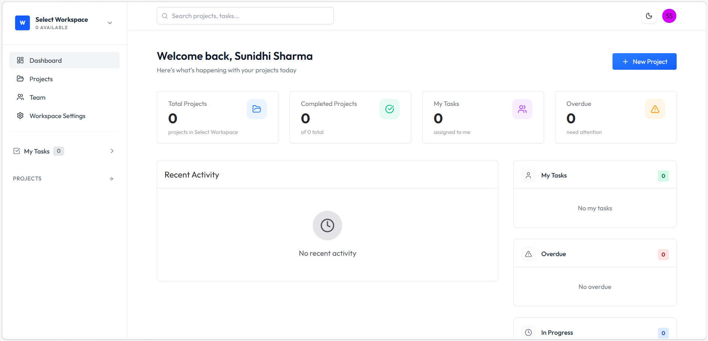
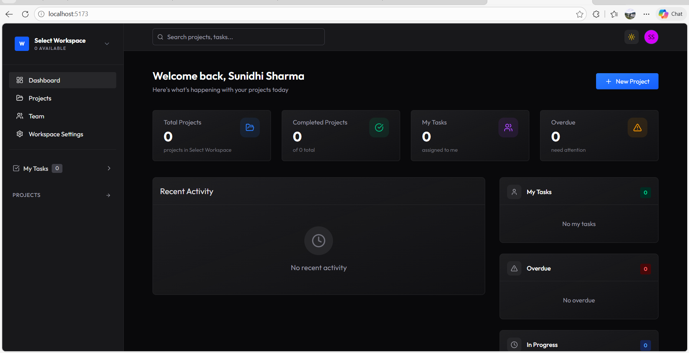
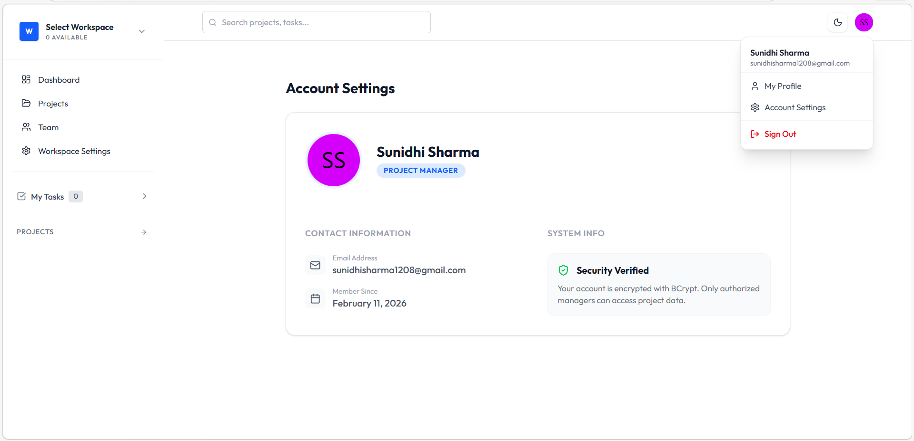

# 🚀 StackFlow Manager
**Enterprise-Grade Workspace & Project Management Platform**


StackFlow Manager is a full-stack SaaS-style application designed for high-performance team collaboration. This project moves beyond basic CRUD operations to explore complex state management, relational data modeling in NoSQL, and advanced middleware security patterns.

---

## 📸 System Overview

## 📸 Visual Overview

| Light Mode Interface | Dark Mode Interface |
| :---: | :---: |
|  |  |

| User Identity & Account Security |
| :---: |
|  |
---

## 🧠 Architectural Techniques & Engineering Decisions

### 1. Advanced State Management (Redux Toolkit + Immer)
Instead of frequent API polling, I implemented **Optimistic UI Updates**. Using Redux Toolkit’s built-in Immer integration, the application predicts the success of server actions (like adding a task) and updates the UI instantly, rolling back only if the server fails. This results in zero-latency perception for the user.

### 2. Relational Modeling in MongoDB
To solve the "Nested Data" problem in NoSQL, I designed a **Reference-Based Schema**.
- **Workspaces** act as the primary containers.
- **Projects** are linked via ObjectIDs to Workspaces.
- **Tasks** utilize a dual-reference system to connect to both Projects and Assignees, ensuring 1-to-N relationships remain scalable.

### 3. Role-Based Access Control (RBAC) & Middleware
I developed custom **Server-Side Route Guards**. Before any destructive action (like `DELETE /api/project`), the middleware intercepts the request to verify the user's role and workspace membership, preventing ID-traversal attacks.

### 4. Human-Readable Routing (Slugs)
To improve UX and SEO, I implemented a **Slugification Hook** in the Mongoose model. This converts workspace names (e.g., "Team Alpha!") into clean URL identifiers (`team-alpha`), moving away from obfuscated database IDs in the frontend routes.

---

## 🛠️ Tech Stack

- **Frontend**: React 18, Vite, Tailwind CSS, Redux Toolkit
- **Backend**: Node.js, Express.js
- **Database**: MongoDB (Mongoose ODM)
- **Authentication**: JSON Web Tokens (JWT), BCrypt.js
- **Icons & UI**: Lucide-React, Framer Motion (Animations)

---

## ⚙️ Configuration & Local Deployment

### Prerequisites
- Node.js (v18+)
- MongoDB Atlas Account

### Quick Start
1. **Clone & Install**:
   ```bash
   git clone [https://github.com/YOUR_USERNAME/StackFlow-Manager.git](https://github.com/YOUR_USERNAME/StackFlow-Manager.git)
   npm install
   ```
2. **Environmental Variables**:
    Create a .env file in the root directory:
   ```bash
    PORT= 5000
    MONGO_URI= mongodb_url
    EMAIL_USER= email_id
    EMAIL_PASS= your_email_pass
    JWT_SECRET= your_secure_secret
   ```

3. **Execution**:
   ```bash
    # Start Server
    node server.js
    # Start Client
    npm run dev
   ```
👤 Lead Developer
Sunidhi Sharma
