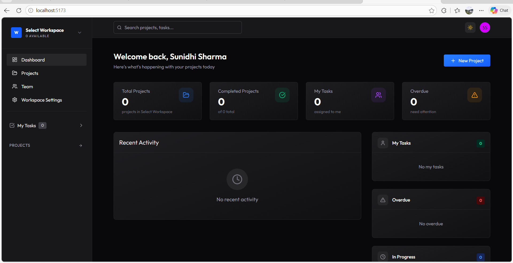
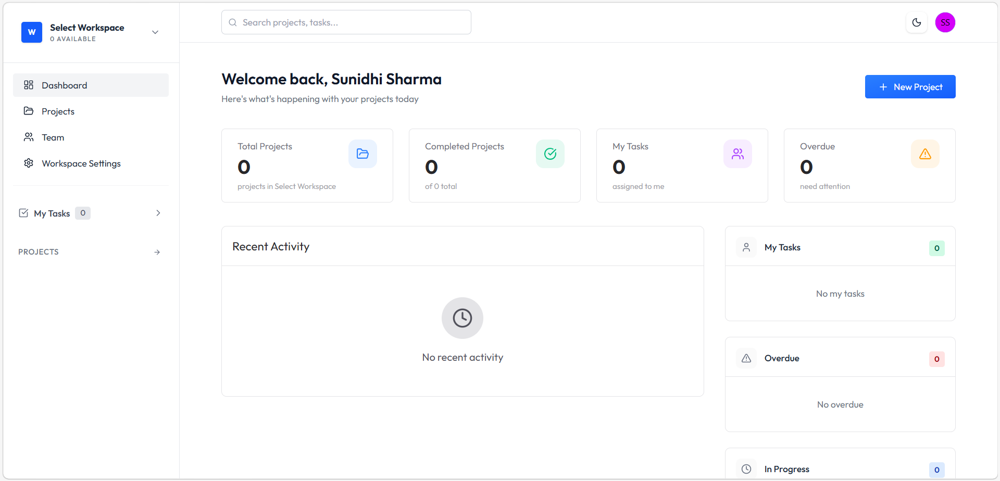
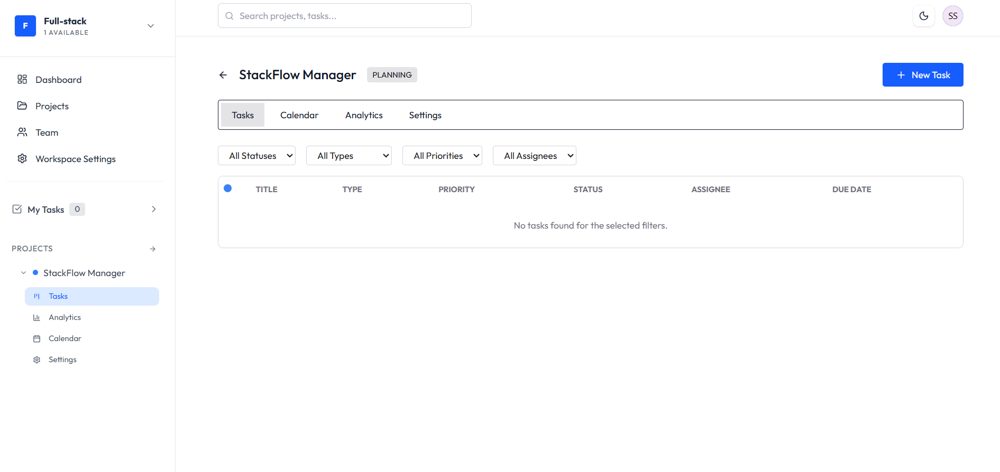
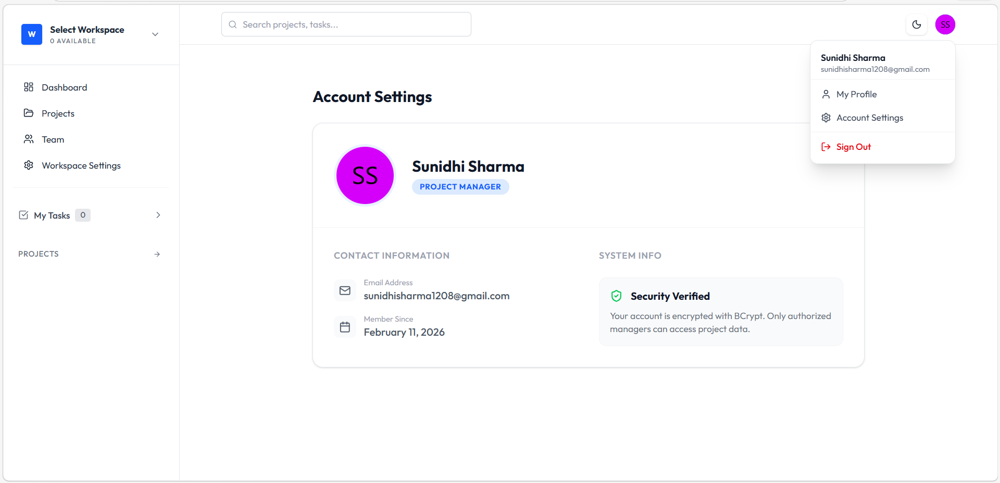

<div align="center">

# StackFlow Manager

**Enterprise-grade workspace & project management — built for real teams.**

[](https://stack-flow-manager.vercel.app/)


</div>

---

## Overview

StackFlow Manager is a full-stack SaaS-style project management platform that lets teams create workspaces, manage projects, assign tasks, and collaborate — all in real time. It features WebSocket-powered live updates, JWT authentication, Role-Based Access Control, and a polished dual-theme UI.

---

## Screenshots

<table>
  <tr>
    <td align="center"><b>Dashboard — Dark Mode</b></td>
    <td align="center"><b>Dashboard — Light Mode</b></td>
  </tr>
  <tr>
    <td></td>
    <td></td>
  </tr>
  <tr>
    <td align="center"><b>Project Details & Task Board</b></td>
    <td align="center"><b>Profile & Account Settings</b></td>
  </tr>
  <tr>
    <td></td>
    <td></td>
  </tr>
</table>

---

## Features

### ⚡ Real-Time Collaboration
Live WebSocket synchronization powered by Socket.io. Events are scoped to workspace and project rooms so clients only receive updates relevant to them. A live connection indicator is shown in the Dashboard and Project Detail headers.

### 🔐 JWT Authentication
All protected routes require a `Bearer` token. Tokens are issued on login/register with a 7-day expiry. A centralized `api.js` utility auto-injects auth headers on every request.

### 🛡️ Role-Based Access Control (RBAC)
`requireAdmin` middleware blocks destructive workspace operations for non-admins. All write operations are verified server-side.

### 📋 Project & Task Management
Create workspaces, spin up projects, and break work into tasks with status, type, priority, assignees, due dates, and comments.

### 📅 Calendar & Analytics Views
Each project ships with a calendar view for deadline visibility and an analytics view with Recharts for progress tracking.

### 🎨 Dual-Theme UI
Fully polished light/dark mode with Tailwind CSS. Theme preference is persisted via Redux.

### 📧 Email Invites
Workspace admins can invite members via email (Nodemailer + Gmail App Password).

---

## Tech Stack

| Layer        | Technologies                                                            |
| ------------ | ----------------------------------------------------------------------- |
| **Frontend** | React 19, Vite, Tailwind CSS v4, Redux Toolkit, Framer Motion, Recharts |
| **Backend**  | Node.js, Express 4, Socket.io                                           |
| **Database** | MongoDB (Mongoose ODM)                                                  |
| **Auth**     | JWT (jsonwebtoken), BCrypt.js                                           |
| **Email**    | Nodemailer (Gmail)                                                      |

---

## Architecture

**Real-Time Layer** — Socket.io runs on the same HTTP server as Express. The `SocketContext` on the frontend automatically joins workspace/project rooms and dispatches incoming events directly into the Redux store.

**Optimistic UI** — Redux Toolkit handles instant UI updates. Socket.io broadcasts to all connected clients, ensuring consistency across tabs and users.

**NoSQL Schema** — MongoDB uses ObjectID references: `Workspaces → Projects → Tasks → Assignees`.

**Middleware Chain** — Every protected route passes through `authenticate` (validates JWT) → optionally `requireAdmin` (checks member role).

---

## Project Structure

```
StackFlow-Manager/
├── backend/
│   ├── server.js             ← entry point
│   ├── app.js                ← express setup + routes
│   ├── config/
│   │   ├── db.js             ← MongoDB connection
│   │   ├── socket.js         ← Socket.io init
│   │   └── mailer.js         ← Nodemailer transporter
│   ├── middleware/
│   │   └── auth.middleware.js ← JWT + RBAC
│   ├── models/
│   │   ├── User.js
│   │   ├── Workspace.js
│   │   ├── Project.js
│   │   ├── Task.js
│   │   └── Comment.js
│   ├── controllers/
│   │   ├── auth.controller.js
│   │   ├── user.controller.js
│   │   ├── workspace.controller.js
│   │   ├── project.controller.js
│   │   ├── task.controller.js
│   │   └── comment.controller.js
│   └── routes/
│       ├── auth.routes.js
│       ├── user.routes.js
│       ├── workspace.routes.js
│       ├── project.routes.js
│       ├── task.routes.js
│       └── comment.routes.js
│
├── frontend/
│   ├── src/
│   │   ├── app/              ← Redux store
│   │   ├── components/       ← Reusable UI components
│   │   ├── context/          ← SocketContext
│   │   ├── features/         ← Redux slices (auth, workspace, theme)
│   │   ├── pages/            ← Route-level page components
│   │   ├── utils/            ← api.js helper
│   │   └── App.jsx
│   └── index.html
│
└── screenshots/
```

---

## Getting Started

### Prerequisites
- Node.js v18+
- MongoDB Atlas account (or local MongoDB)

---

### Backend Setup

```bash
cd backend
npm install
```

Create `backend/.env`:

```env
PORT=5000
MONGO_URI=mongodb+srv://<user>:<password>@cluster0.mongodb.net/stackflow
JWT_SECRET=your_long_random_secret_here
CLIENT_URL=http://localhost:5173
EMAIL_USER=yourgmail@gmail.com
EMAIL_PASS=xxxx xxxx xxxx xxxx
```

> **Gmail App Password:** Google Account → Security → 2-Step Verification → App Passwords → generate a 16-character password.

```bash
node server.js   # or: npm start
```

---

### Frontend Setup

```bash
cd frontend
npm install
```

Create `frontend/.env`:

```env
VITE_BASE_URL=http://localhost:5000
```

```bash
npm run dev
```

Open [http://localhost:5173](http://localhost:5173)

---

## Deployment

### Backend → Render
1. Connect GitHub → select **`backend`** as root directory
2. Build command: `npm install`
3. Start command: `node server.js`
4. Add environment variables (same as `backend/.env` but with production values):

| Key | Value |
|-----|-------|
| `MONGO_URI` | your Atlas connection string |
| `JWT_SECRET` | any long random string |
| `CLIENT_URL` | `https://stack-flow-manager.vercel.app` |
| `EMAIL_USER` | your Gmail address |
| `EMAIL_PASS` | your 16-char Gmail App Password |
| `PORT` | `5000` |

### Frontend → Vercel
1. Connect GitHub → select **`frontend`** as root directory
2. Framework preset: **Vite**
3. Add environment variable:

| Key | Value |
|-----|-------|
| `VITE_BASE_URL` | `https://your-render-url.onrender.com` |

---

## Keep Backend Alive (Free Render Tier)

Render's free tier spins down after 15 minutes of inactivity (causing 50s cold starts).
Fix it for free with [UptimeRobot](https://uptimerobot.com):

1. Sign up free
2. New Monitor → **HTTP(s)**
3. URL: `https://your-render-url.onrender.com/health`
4. Interval: **every 5 minutes**

---

## Author

**Sunidhi Sharma** — Full-Stack Developer

[](https://github.com/Sunidhi-source)

---

<div align="center">
  <sub>Built with React, Node.js, MongoDB, and Socket.io</sub>
</div>
